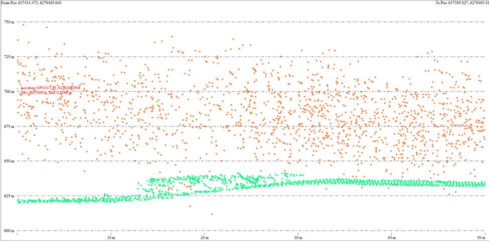
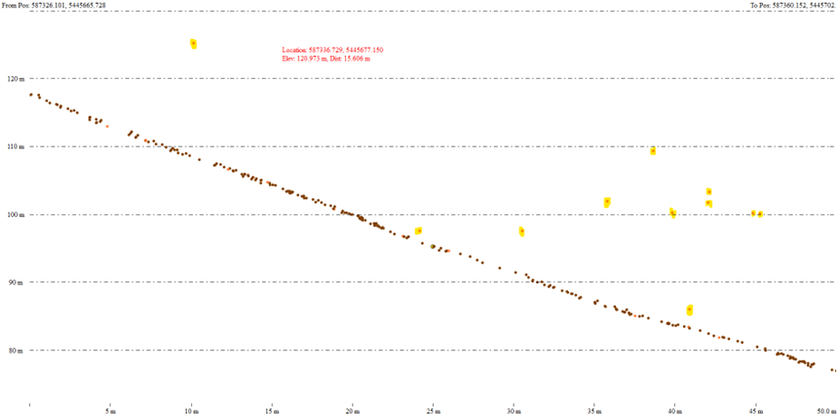

## **LiDAR Purifier**

This repository contains a set of command-line tools developed as a research project during
my Software Developer Co-op at GeoBC, focused on identifying and classifying noise in airborne
LiDAR datasets. The work explores region growing algorithms, classical Kalman filtering approaches and Unscented Kalman Filter (UKF)
techniques to improve the quality of ground-class point clouds.

---

## Table of Contents

1. [Project Overview](#project-overview)  
2. [Repository Structure](#repository-structure)  
3. [Dependencies & Installation](#dependencies--installation)  
4. [Usage](#usage)  
    - [1. CloudFinder (Region-Growing)](#1-cloudfinder-region-growing)  
    - [2. Kalman Filter Batch Processor](#2-kalman-filter-batch-processor)  
    - [3. UKF-based Noise Detector](#3-ukf-based-noise-detector)  
5. [Scripts & File Descriptions](#scripts--file-descriptions)  
6. [Configuration Options](#configuration-options)  
7. [Results & Outputs](#results--outputs)  
8. [Example Results](#example-results)  
9. [Author & Acknowledgements](#author--acknowledgements)  


---

## Project Overview

During my co-op term at GeoBC, I investigated methods to automatically detect and classify noise in ground-class LiDAR points. The objective was to:

- Rapidly identify clusters of valid ground returns vs. isolated noise points (e.g., birds, clouds, sensor artifacts).
- Compare classical 1D Kalman filtering to more advanced UKF strategies for robust performance on hilly terrain.
- Provide reusable, scalable command-line tools for processing large LAS/LAZ datasets.

---

## Repository Structure

```
├── images
├── cloudfinder.py
├── las_kalman_batch_noise_detector.py
├── ukf_lidar_noise_detector.py
├── requirements.txt
└── README.md
```

---

## Dependencies & Installation

1. **Python 3.8+**
2. Create a virtual environment:
   ```bash
   python -m venv venv
   source venv/bin/activate      # Linux/macOS
   venv\\Scripts\\activate     # Windows
   ```
3. Install dependencies:
   ```bash
   pip install -r requirements.txt
   ```

---

## Usage

All scripts support the `--help` flag to display usage details.

### 1. CloudFinder (Region-Growing)

Detects noise by region-growing clusters in 3D space:

```bash
python cloudfinder.py \
  <input_las> <output_las> \
  --grid_size 20.0 --distance_threshold 5.0
```

### 2. Kalman Filter Batch Processor

Applies 1D Kalman filtering to ground classes (2 & 7) across a folder of LAS/LAZ files:

```bash
python las_kalman_batch_noise_detector.py \
  /path/to/input_folder \
  /path/to/output_folder \
  /path/to/kalman_percents.txt \
  --noise_threshold 13.0
```

### 3. UKF-based Noise Detector

Leverages an Unscented Kalman Filter for robust smoothing on hilly terrain:

```bash
python ukf_lidar_noise_detector.py \
  <input_laz> <output_las> \
  --ground_classes 2 7 \
  --noise_class_id 19 \
  --chunk_size 250000 \
  --threshold 0.075 \
  --process_noise_Q 8.0 \
  --measurement_noise_R 0.20
```

---

## Scripts & File Descriptions

- **cloudfinder.py**  
  Region-growing algorithm using a KD-tree to group points; labels unreachable points as noise.

- **las_kalman_batch_noise_detector.py**  
  Batch runner: applies a 1D Kalman filter to ground-class elevations, and outputs both reclassified LAS files and a summary text file of noise percentages.

- **ukf_lidar_noise_detector.py**  
  Applies an Unscented Kalman Filter on chunks of ground elevations; supports command-line tuning of UKF parameters.

- **requirements.txt**  
  Lists all Python dependencies.

---

## Configuration Options

All scripts offer flags for:

- **Grid size** (`--grid_size`) & **distance threshold** (`--distance_threshold`) for region growing.
- **Noise threshold** (`--threshold`) for allowable deviation before flagging noise.
- **Process noise (Q)** & **measurement noise (R)** variances for both Kalman and UKF filters.
- **Chunk size** for parallel UKF processing.

Customize these to match flight characteristics, terrain ruggedness, and point density.

---

## Results & Outputs

- **Reclassified LAS/LAZ files**  
  Original ground points exceeding the noise threshold are assigned a new classification ID (e.g., 18 or 19).

- **Summary text files**  
  Tabulates per-file percentages of noise-detected ground points for batch runs. (only las_kalman_batch_noise_detector.py)

---
## Example Results


Example path profile of CloudFinder output, with noise points coloured orange and non-noise points coloured green.



Example path profile of Unscented Kalman Filter output using sloped input data, with noise points highlighted in yellow and ground points coloured brown.

---

## Author & Acknowledgements

**Miles Rose**  
Software Developer Co-op, GeoBC  

Thanks to the GeoBC LiDAR team for guidance and data access during this research project.

